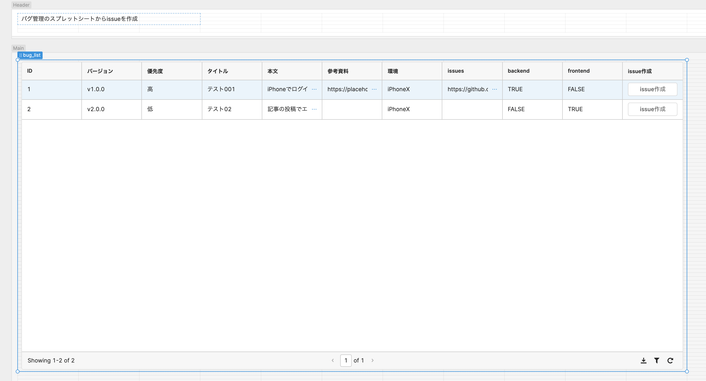

# issueを作成するAPIを生成

■ 対象のスプレットシート
https://docs.google.com/spreadsheets/d/16VnhxrxgA9KZVzN_EeykRRTEku0rYabmDot4GXTTO0k/edit#gid=0


Retoolで表示




## デプロイ

```
$ export GITHUB_APP_PRIVATE_KEY=$(cat private-key.pem)

$ gcloud functions deploy CreateIssue --set-env-vars GITHUB_APP_PRIVATE_KEY=$GITHUB_APP_PRIVATE_KEY,GITHUB_APP_ID=$GITHUB_APP_ID,GITHUB_OWNER=$GITHUB_OWNER,INSTALLATION_ID=$INSTALLATION_ID,VERIFY_ID_TOKEN=$VERIFY_ID_TOKEN --runtime go116 --trigger-http --region asia-northeast1
```
