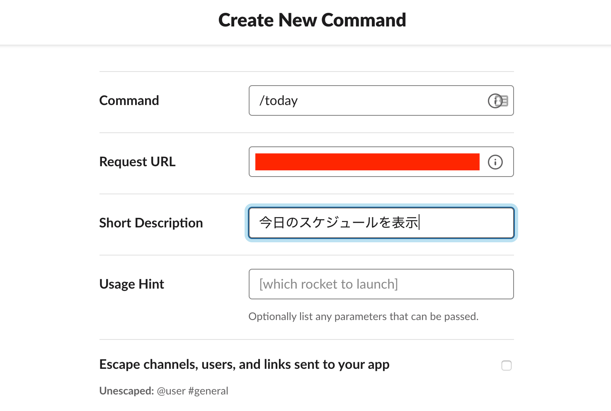

# slackコマンドで当日のカレンダーの情報を表示

## セットアップ

```
$ npm i @google/clasp -g
```

## プロジェクトを開く

```
$ clasp open
```

## プロジェクトをpush

```
$ clasp push
```

## フォーマット

```
$ npx prettier --write ./slackCommand.js 
```

## slack

Slash CommandsにGASのアプリ化したURLを設定


